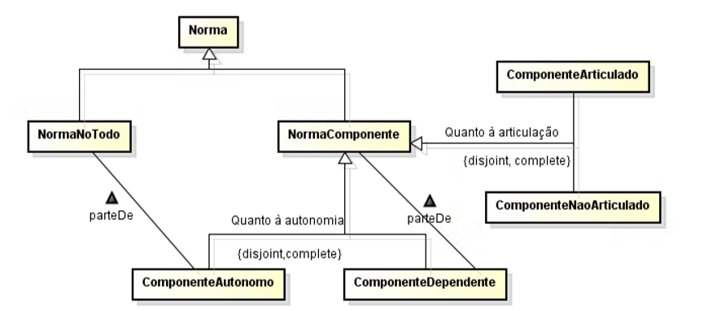
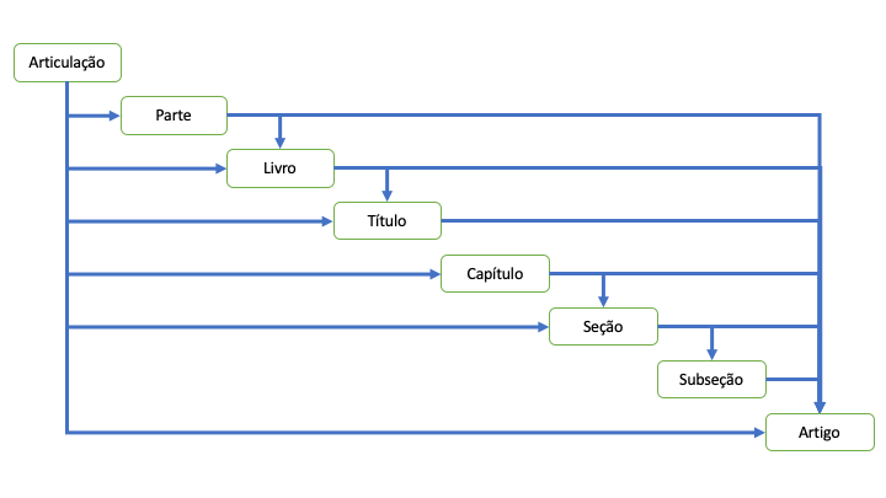
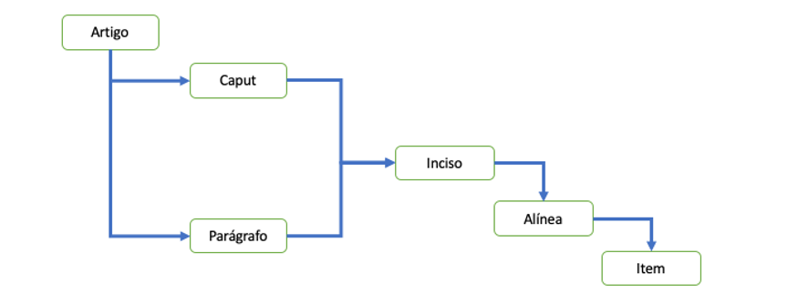

Requisitos para o Editor de Normas Jurídicas - LexEdit

## Introdução

A autoria de normas jurídicas pode se beneficiar de uma solução que codifique as regras de técnica legislativa estabelecidas em normas jurídicas como também as regras convencionadas pela tradição legislativa do Brasil.

Uma norma jurídica se expressa por meio de textos e outros elementos visuais, sendo todos eles manifestados em edições de algum periódico oficial. Além de texto hierárquico e articulado, a norma jurídica pode se manifestar por outros meios, tais como fórmulas, figuras, tabelas, texto corrido não articulado e partitura.

Pode-se estruturar a expressão de uma norma jurídica por meio de uma série de **componentes**, que são segmentos de símbolos em sequência que formam a expressão de parte de uma norma.

Quanto à articulação, o componente pode ser articulado ou não-articulado. Quanto à sua dependência existencial, o componente pode ser autônomo ou dependente, sendo, este último, sempre vinculado a um outro componente. Essas duas partições lógicas são apresentadas na Figura 1.

**Figura 1.** Relação entre Norma e Componentes.

O presente documento focará na edição de **componentes articulados**, sejam eles autônomos ou dependentes.

A edição de componentes não articulados pode ser implementada por um editor genérico de html.

Apesar de não haver norma de técnica legislativa vedando, deve-se coibir a inclusão de tabelas no meio do texto articulado, devendo ser posicionado em anexo não articulado. Há quem defenda que os projetos de lei são peças para serem lidas e a presença de tabelas dificultaria essa tarefa. Dessa forma, justifica-se, sempre que possível, separar os elementos não puramente textuais em anexos referenciados no texto articulado, o que contribui também com a acessibilidade.

A estrutura deste documento apresenta inicialmente requisitos gerais, seguidos de requisitos sobre a estrutura e finalizando com requisitos sobre o conteúdo (o que vai dentro da tag “p”).

## Requisitos Gerais

### Princípios da Técnica Legislativa

As disposições normativas devem ser redigidas com clareza, precisão e ordem lógica (LCP 95, art.11).

A seção Requisitos de Conteúdo apresentam requisitos que endereçam os princípios mencionados.

### Metadados de Identificação

O editor deve apresentar um diálogo para que sejam informados os seguintes elementos: tipo da norma/proposição, autoridade da norma (opcional), ementa e preâmbulo.

#### Apresentação dos metadados de Identificação

A ementa é uma descrição sucinta do conteúdo da norma, apresentada de forma recuada com alinhamento à direita, após a epígrafe a antes do preâmbulo.

O preâmbulo indica de forma textual a autoridade e o fundamento legal do ato. Em normas infralegais, o preâmbulo lista também os considerandos (razões para a edição da norma). O editor deve sugerir um preâmbulo default (cadastrado previamente) de acordo com o tipo de norma informado.

A epígrafe, apresentada em maiúsculas e de forma centralizada, contém a informação de tipo da norma, número, data e, nos casos de autoridade não convencionada, autoridade emitente.

### Gestão de Modelos

O Editor deve permitir cadastrar uma coleção de textos modelos com um questionário associado, a exemplo do que ocorre com o LexEdit Requerimentos, para auxiliar na autoria de atos normativos recorrentes. Essa funcionalidade será muito importante para os atos infralegais, onde a recorrência dos tipos de conteúdo das normas é muito grande.

### Unicode

A edição de normas deve utilizar o conjunto de caracteres Unicode na forma UTF-8.

### Exportação, Importar e Copiar/colar

O editor deve permitir a exportação do texto completo da norma para o formato DOCX, LexML e PDF/A-3 com LexML anexado.

O editor deve permitir importar DOCX via parser da norma no todo ou de um novo segmento em norma já existente por meio copiar+colar com apoio do parser. Os números de artigos importados serão redefinidos de acordo com a posição em que se fez a operação.

### Fonte

A fonte (Calibri, Gentium etc.) de edição e de exportação para DOCX deve ser configurável.

### Notas e Comentários

O editor deve permitir o registro de notas e comentários.

## Requisitos Formais

### Estrutura básica

Um componente articulado possui a Articulação como elemento raiz da estrutura.

A unidade básica de articulação é o **artigo**, que, a rigor, deve tratar de um único assunto.

Os artigos podem ser agrupados de forma hierárquica conforme a seguir: Parte, Livro, Título, Capítulo, Seção e Subseção.

O nível inicial da hierarquia é escolhido de acordo com a necessidade de organização do conteúdo normativo. Normas simples, com poucos artigos, não precisam utilizar agrupamentos hierárquicos. Já códigos, que expressam o conteúdo normativo de um determinado ramo do Direito, normalmente iniciam por Parte, desdobrando-se nos níveis subsequentes. Outras normas podem começar a partir de Livro ou, como na Constituição de 1988, em Título. Não existe óbice para que uma norma seja estruturada a partir de Capítulo ou Seção, contudo, não há muito sentido permitir a estruturação iniciando por Subseção, pois o nome já indica a existência de uma seção no nível superior.

Uma norma ou um agrupamento de artigo pode conter artigos antecedendo o próximo agrupamento de artigo. Por exemplo, um Título pode iniciar com três artigos seguidos de Capítulos que agrupam os artigos que vêm na sequência.

As possibilidades de desdobramento de uma articulação em relação aos agrupamentos de artigos e ao artigo são resumidas na Figura 2.

**Figura 2.** Relações de Agrupamento de Artigos.

O editor deve permitir aumentar ou diminuir os elementos que definem a hierarquia de agrupamentos dos artigos. Por exemplo, uma norma que foi estruturada em Capítulos, Seções e Subseções pode ter esses agrupamentos recategorizados para Títulos, Capítulos e Seções respectivamente, abrindo, dessa forma, mais um nível para futuros desdobramentos da hierarquia da norma.

O editor deve oferecer apenas os agrupamentos disponíveis de acordo com o contexto. Por exemplo, dentro de uma Seção apenas Subseções podem ser definidas. Contudo, estando posicionado na última Seção de Capítulo, dentro desta seção deve ser possível definir um Capítulo.

O editor deve permitir ter uma visão sumária da hierarquia da norma, podendo ser uma árvore com ocultação configurável pelo usuário, permitindo ainda visualizar os pontos da hierarquia onde foram definidas notas ou comentários.

O artigo é composto obrigatoriamente pelo caput e opcionalmente por um ou mais parágrafos. Enquanto o caput apresenta a ideia principal do artigo, reserva-se aos

parágrafos o espaço para tratar de aspectos complementares e de exceções.O conteúdo do caput de artigo e de parágrafos, casos existam enumeração de elementos, podem ser desdobrados de forma hierárquica em incisos, alíneas e itens, conforme apresentado na Figura 3.

**Figura 3.** Detalhamento de Artigo.

O editor deve permitir recategorizar um parágrafo como artigo a ser posicionado logo após o artigo de origem.

O editor deve permitir recategorizar um caput de artigo como parágrafo (sugestão: no caso de drag-and-drop de um artigo sobre o outro, o artigo movido pode ser “recepcionado” como parágrafo). Os eventuais incisos de um caput devem ir junto para o novo parágrafo no artigo destinatário (pois é parte integrante dele). Caso esse artigo possua mais de um parágrafo, pode-se perguntar se:

I - que transformar os demais parágrafos em artigos independentes;

II - se quer transformar o primeiro parágrafo remanescente em caput; ou

III - se quer mover esse(s) parágrafo(s) para o mesmo artigo destinatário como parágrafo.

Note que para um caput ser transformado em parágrafo é necessário já existir um artigo com caput que o irá recepcionar.

O editor deve permitir recategorizar um conjunto de elementos de enumeração (inciso, alínea ou item) para um nível superior ou inferior em relação ao tipo atual.

O editor deve permitir mover elementos para destinos compatíveis com o elemento que está sendo movido. Dessa forma, por meio dessa funcionalidade, artigos podem ser reposicionados e a ordem de parágrafos, incisos, alíneas e itens pode ser alterada.

Essa especificação de requisitos não aborda o uso de dispositivos ou agrupamentos genéricos pois a definição desses elementos no esquema LexML foi motivada pela compatibilidade com o legado de textos já publicados, não se aplicando para uma ferramenta que só permite a autoridade de documentos em conformidade com a legislação vigente. A única ressalva em relação a isso é sobre o tratamento desse tipo de dispositivo dentro de blocos de alteração.

### Blocos de Alteração

Sob qualquer um dos elementos que detalham o artigo, pode-se especificar um bloco de alteração que referencia dispositivos que estão sendo modificados ou acrescidos em uma norma existente. O elemento que introduz o bloco de alteração deve especificar de forma única a norma que está sendo alterada.

O bloco de alteração é delimitado por aspas curvas e pode ser seguido de uma nota (atualmente só se tem utilizado “(NR)” para indicar nova redação, apesar da LCP 95/98 prever também a nota “(AC)”).

Dentro de um bloco de alteração é comum a especificação de omissis (linha pontilhada, opcionalmente precedida do rótulo) que permite indicar o contexto do elemento que está sendo alterado. Por exemplo, uma norma que irá alterar o caput do art. 20, o seu inciso IV, o § 12 e a alínea “c” do inciso III do § 14 (considerando que o artigo tem 20 parágrafos) utiliza a seguinte codificação.

| “Art. 20 novo texto do caput vai aqui:  .............................................................  IV – novo texto do inciso  .............................................................  § 12. Novo texto do parágrafo.  .............................................................  § 14. ...................................................  ............................................................  III – .....................................................  .............................................................  c) novo texto da alínea;  ............................................................” (NR) | Indica que existem elementos após o caput  Indica que existem elementos após o inciso IV  Indica que existem elementos após o § 12.  Indica que o parágrafo 14 será alterado  Indica que existem incisos não alterados  Indica que o inciso III será alterado  Indica que existem alíneas não alteradas  Indica que existem elementos após a alínea “c”. |
| --- | --- |

Os omissis podem ser utilizados de forma análoga para posicionar os agrupamentos de artigos, como no exemplo abaixo:

| “PARTE ESPECIAL  ..............................................................................................  LIVRO II  ..............................................................................................  TÍTULO I-A  DA EMPRESA INDIVIDUAL DE RESPONSABILIDADE LIMITADA  Art. 980-A. A empresa individual de responsabilidade limitada será constituída por uma única pessoa titular da totalidade do capital social, devidamente integralizado, que não será inferior a 100 (cem) vezes o maior salário-mínimo vigente no País.  § 1º O nome empresarial deverá ser formado pela inclusão da expressão “EIRELI” após a firma ou a denominação social da empresa individual de responsabilidade limitada.  § 2º A pessoa natural que constituir empresa individual de responsabilidade limitada somente poderá figurar em uma única empresa dessa modalidade.  § 3º A empresa individual de responsabilidade limitada também poderá resultar da concentração das quotas de outra modalidade societária num único sócio, independentemente das razões que motivaram tal concentração.  ..............................................................................................” | Indica que existem outros livros antes.  Indica que existe outro título antes.  Indica que existem outros elementos depois. |
| --- | --- |

Sempre que for preciso especificar um agrupamento de artigo, é necessário que isso seja feito a partir do agrupamento de nível mais alto, como no exemplo acima que usou “Parte”. Caso iniciasse por Livro, a especificação poderia ser ambígua pois pode existir o “Livro II” dentro de outra parte.

Quando existir a base de dados de normas jurídicas com o texto atualizado, o editor deverá obter o texto atual e permitir que o usuário defina as alterações necessárias para a geração automática e segura do bloco de alteração, a exemplo do que foi implementado no Editor de Emendas (Swing).

### Elementos de Técnica Legislativa Penal

A articulação de dispositivos penais prevê a possibilidade de especificações de característica jurídicas tais como penas, medidas administrativas e infrações. Esses elementos podem estar vinculados a qualquer um dos elementos que detalham o artigo.

Exemplo:

Art. 197 – Constranger alguém, mediante violência ou grave ameaça:

I – a exercer ou não exercer arte, ofício, profissão ou indústria, ou a trabalhar ou não trabalhar durante certo período ou em determinados dias:

**Pena** – detenção, de um mês a um ano, e multa, além da pena correspondente à violência;

II – a abrir ou fechar o seu estabelecimento de trabalho, ou a participar de parede ou paralisação de atividade econômica:

**Pena** – detenção, de três meses a um ano, e multa, além da pena correspondente à violência.

Os rótulos mais comuns para identificar esses tipos de dispositivos são: “Pena”, “Penalidade”, “Medida Administrativa” e “Infração”, todos esses reconhecidos pelo parser.

Além disso, é também comum, na técnica legislativa penal, o uso de títulos para nomear dispositivos (no LexML schema, o nome desse elemento é TituloDispositivo), tal como o apresentado no exemplo abaixo:

**Homicídio simples**

Art. 121. Matar alguém:

Pena – reclusão, de seis a vinte anos.

**Caso de diminuição de pena**

        § 1º Se o agente comete o crime impelido por motivo de relevante valor social ou moral, ou sob o domínio de violenta emoção, logo em seguida a injusta provocação da vítima, o juiz pode reduzir a pena de um sexto a um terço.

**Homicídio qualificado**

        § 2° Se o homicídio é cometido:

        I – mediante paga ou promessa de recompensa, ou por outro motivo torpe;

        II – por motivo fútil;

        III – com emprego de veneno, fogo, explosivo, asfixia, tortura ou outro meio insidioso ou cruel, ou de que possa resultar perigo comum;

        IV – à traição, de emboscada, ou mediante dissimulação ou outro recurso que dificulte ou torne impossível a defesa do ofendido;

        V – para assegurar a execução, a ocultação, a impunidade ou vantagem de outro crime:

        Pena – reclusão, de doze a trinta anos.

Fora da técnica legislativa penal também é possível encontrar títulos que nomeiam artigos, contudo é raro, sendo mais comum em textos de decretos do Executivo.

### Rótulos

Os rótulos nomeiam os elementos estruturais e devem ser calculados à medida em que o texto normativo é criado. Tem a função de identificar o elemento estrutural o que viabiliza a referência por meio de remissões internas (para a própria norma) ou externas.

De forma geral, aos rótulos são associados um número (arábico ou romano) ou uma letra, derivados da sua posição em relação ao dispositivo hierarquicamente superior.

O Editor deve gerar todos os rótulos de forma automática. Os rótulos só serão informados dentro de blocos de alteração.

No caso de dispositivos que ocorrem dentro de bloco de alteração de normas, os números dos rótulos podem ser seguidos de uma letra maiúscula precedida de hífen que serve para indicar a posição onde o elemento será inserido entre elementos já existentes. Essa técnica de encaixe pode ocorrer de forma recursiva, isto é, o “Art. 61-A-A” posiciona-se entre os “Art. 61-A” e “Art. 61-B”.

Existem regras específicas para expressar rótulos de artigos, elementos de agrupamento de artigos e elementos de detalhamento de artigos.

#### Rótulo de Artigo

Os rótulos de artigo são iniciados pela abreviatura “Art.” seguida de um número arábico e do símbolo de ordinal masculino (*Unicode Character* ‘MASCULINE ORDINAL INDICATOR’ (U+00BA)) caso esse número seja até 9 (nono). A partir do décimo, o número passa a ser seguido de um ponto, e não ocorre o símbolo de ordinal. Os números devem apresentar o ponto como separador de milhar, se necessário.

Caso só exista um único artigo o rótulo deve ser “Art. único.”.

A Tabela 1 apresenta exemplos de rótulos de artigos válidos e inválidos.

Tabela 1. Exemplos de Rótulos de Artigo.

| **Tipo** | **Exemplo** | **Observação** |
| --- | --- | --- |
| Válido | Art. 1º | MASCULINE ORDINAL INDICATOR’ (U+00BA) |
| Art. 9º |  |
| Art. 10. |  |
| Art. 11-A. | Permitido dentro de bloco de alteração |
| Art. 1.322. |  |
| Art. 11-A-A. |  |
| Art. único. |  |
| Inválido | Art. 1° | Símbolo de grau – Unicode U+00B0 |
| Art. 1<u>o</u> | Letra “o” sobrescrita com sublinha |
| Art. 1. | Falta o ordinal e sobra o ponto |
| Art. 10 | Falta o ponto |
| Art. 11 - | Hífen sobrando |
| Art.12. | Falta o espaço em branco |
| Art. 5º. | Sobra o ponto após o símbolo de ordinal |
| Art. 1322. | Falta o ponto do milhar |
| Art. 11-A -A. | Espaço antes do hífen |
| Artigo único. | Artigo por extenso. |

#### Rótulo de Agrupamento de Artigo e suas Denominações

Os rótulos de agrupamentos de artigos são iniciados pelo nome do tipo do agrupamento seguido de número romano em letras maiúsculas. O nome dos tipos dos agrupamentos Parte, Livro, Título e Capítulo devem ser grafados em maiúsculas. Os agrupamentos Seção e Subseção são grafados apenas com a primeira letra maiúscula e as demais minúsculas, sendo realçados em negrito.

Dentro de blocos de alteração, um rótulo pode ser seguido de hífen e letra maiúscula para indicar a inserção entre dois agrupamentos existentes.

Caso dentro de um agrupamento só exista uma ocorrência de um subagrupamento, deve-se utilizar o rótulo “único”, grafado em maiúsculas/minúsculas e com/sem negrito, conforme o contexto.

O agrupamento Parte alternativamente pode ser identificado pelo nome “Parte Geral”, “Parte Especial” (comum em códigos) ou ainda pelo nome “Parte” seguido de número ordinal por extenso.

A Tabela 2 apresenta exemplos de rótulos válidos e inválidos de agrupamento de artigo.

Tabela 2. Exemplo de rótulos de agrupamentos de artigo.

| **Válidos** | **Inválidos** |
| --- | --- |
| TÍTULO I | Título I (Título em minúscula) |
| Seção III | Título 1 (número em arábico) |
| PARTE GERAL | SEÇÃO III (SEÇÃO em maiúscula) |
| PARTE ESPECIAL | CAPÍTULO I -A (espaço em branco antes do hífen) |
| PARTE DOIS | TÍTULO PRIMEIRO (nome ordinal por extenso) |
| CAPÍTULO II-A | TÍTULO ÚNICO (sob o elemento raiz da articulação) |
| CAPÍTULO ÚNICO (sob um título existente) |  |

Os agrupamentos de artigos possuem uma denominação grafada em maiúsculas/minúsculas e com/sem negrito, de acordo com a regra do rótulo que o antecede. O rótulo e a sua respectiva denominação são apresentados em linhas separadas e de forma centralizada. A denominação não se aplica aos casos dos agrupamentos “PARTE GERAL” e “PARTE ESPECIAL”, comum em códigos.

#### Rótulo de Detalhamento de Artigo

O caput não possui rótulo, pois o rótulo é do artigo.

No caso de existir um único parágrafo, o rótulo deve ser “Parágrafo único.”. Nos demais casos, o rótulo de parágrafo possui regras similares ao rótulo do artigo. Inicia-se pelo símbolo “§” e é seguido de numeração arábica ordinal até o nono e apenas arábica seguida de ponto após o décimo.

Os rótulos dos enumeradores (incisos, alíneas e itens) têm regra de formação conforme apresentado na Tabela 3.

Tabela 3. Elementos de formação de rótulos de enumeradores

| **Enumerador** | **Notação** | **Separador** | **Descrição separador** | **Exemplo** |
| --- | --- | --- | --- | --- |
| Inciso | Romana | − | Travessão curto precedido de espaço | I − |
| Alínea | Alfabética | ) | Parêntesis sem espaço | a) |
| Item | Arábica | . | Ponto sem espaço | 1. |

Os parágrafos e os enumeradores dentro de bloco de alteração podem ter o rótulo sufixado por hífen e letra em maiúscula para indicar o acréscimo do elemento entre dois já existentes, a exemplo do que ocorre com o artigo.

As Tabelas 4, 5, 6 e 7 apresentam exemplos válidos e inválidos de rótulos de parágrafos e enumeradores.

Tabela 4. Rótulos válidos e inválidos de parágrafos.

| **Tipo** | **Exemplo** | **Observação** |
| --- | --- | --- |
| Válido | Parágrafo único. |  |
| § 9º | MASCULINE ORDINAL INDICATOR’ (U+00BA) |
| § 10. |  |
| § 11-A. | Permitido dentro de bloco de alteração |
| § 11-A-A. |  |
| Art. único. |  |
| Inválido | § 1° | Símbolo de grau – Unicode U+00B0 |
| § 1<u>o</u> | Letra “o” sobrescrita com sublinha |
| § 1. | Falta ordinal e sobra o ponto |
| § 10 | Falta ponto |
| § 11. - | Hífen sobrando |
| §12. | Falta espaço em branco |
| § 5º. | Sobra o ponto após o símbolo de ordinal |
| § 1322. | Falta ponto do milhar |
| § 11-A -A. | Espaço antes do hífen |
| § único. | Uso de símbolo para parágrafo único. |

Tabela 5. Rótulos válidos e inválidos de incisos.

| **Tipo** | **Exemplo** | **Observação** |
| --- | --- | --- |
| Válido | I − | EN DASH (U+2013) |
| II-A − | Permitido dentro de bloco de alteração |
| III-A-A − |  |
| Inválido | X - | Uso de hífen |
| X− | Falta o espaço em branco |
| X ⎯ | Uso de travessão longo EM DASH (U+2014) |
| XII. | Não use ponto |
| XIII) | Não use parênteses |

Tabela 6. Rótulos válidos e inválidos de alíneas.

| **Tipo** | **Exemplo** | **Observação** |
| --- | --- | --- |
| Válido | a) |  |
| c-A) | Permitido dentro de bloco de alteração |
| z)  aa)  ab)  ...  az)  ba) | Sequência após a letra “z” |
| Inválido | a - | Uso de hífen |
| a ) | Sobra o espaço em branco |
| a. | Uso de ponto |
| c)-A | Sufixo posicionado após o parêntesis |

Tabela 7. Rótulos válidos e inválidos de itens.

| **Tipo** | **Exemplo** | **Observação** |
| --- | --- | --- |
| Válido | 1. |  |
| 1-A. | Permitido dentro de bloco de alteração |
| Inválido | 1 - | Uso de hífen |
| 1) | Uso de parêntesis |
| 1.-A | Sufixo posicionado após o ponto |

A Tabela 8 resume os elementos que especificam os rótulos de artigos e seus dispositivos.

Tabela 8. Especificação Geral dos rótulos.

| **Dispositivo** | **Subtipo** | **Prefixo** | **Descritor** | **Símb.** | **Especificador acrésc. Opc.** | **Sep** | **Nota** |
| --- | --- | --- | --- | --- | --- | --- | --- |
| Artigo | Único | Art. | único |  |  | . |  |
| Entre 1 e 9 | Art. | [1-9] | º | -A |  |  |
| A partir de 10 | Art. | 999.999 |  | -A | . |  |
| Parágrafo | Único | Parágrafo | único |  |  | . |  |
| Entre 1 e 9 | § | [1-9] | º | -A |  |  |
| A partir de 10 | § | 999.999 |  | -A | . |  |
| Inciso |  |  | [Romano] |  | -A | − | Precedido de branco |
| Alínea |  |  | [a-z]+ |  | -A | ) |  |
| Item |  |  | [999.999] |  | -A | . |  |

O especificador de acréscimo opcional não se aplica aos casos de parágrafos único e artigo único pois, nesses casos, sempre se faz o acréscimo na segunda posição e renomeando-se o único para primeiro, no momento da compilação.

Apesar da LCP 95 permitir renumerar dispositivos abaixo de artigo, o LexEdit não deve permitir essa má prática legislativa, pois vai contra a ideia de designadores rígidos (Kripke), essencial para a estabilidade das referências no tempo.

